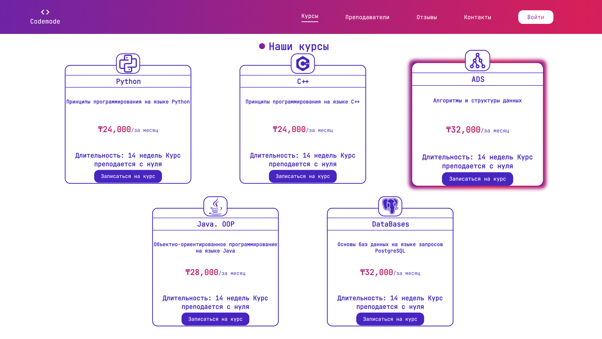
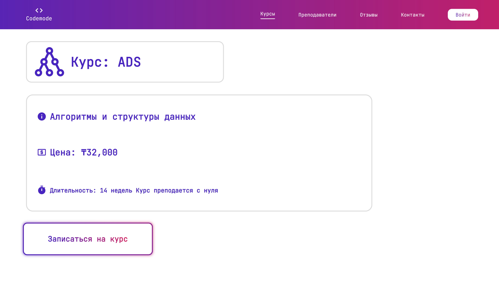
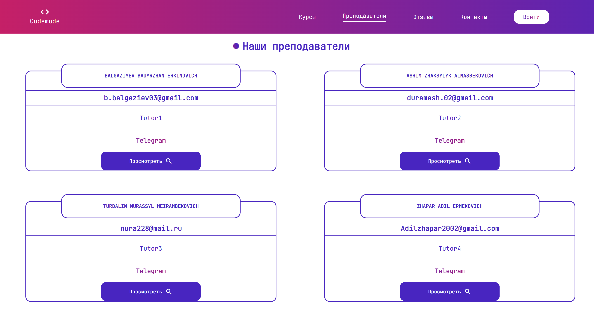
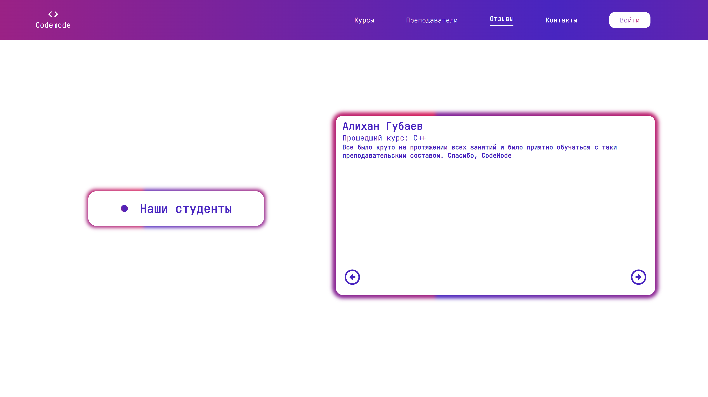
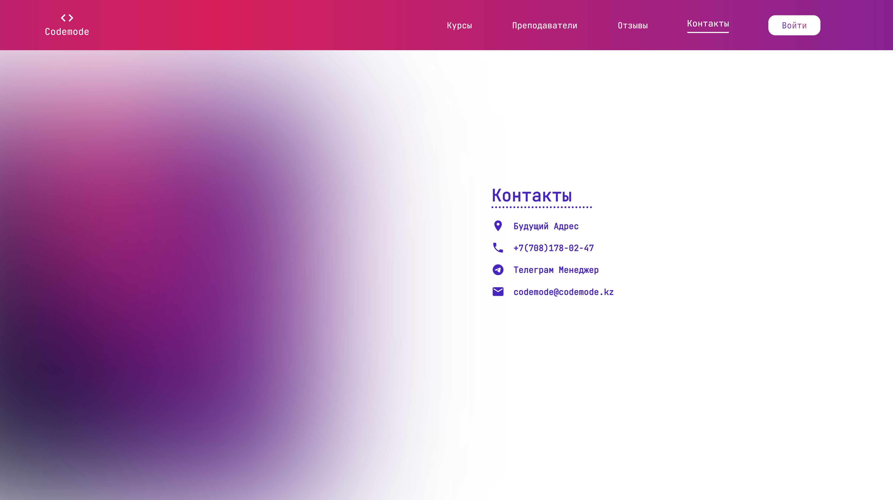
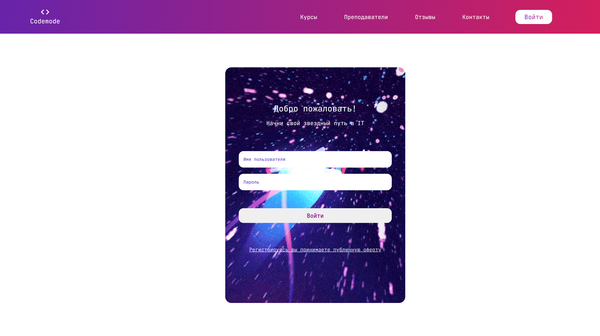

<div id="top"></div>

[![Contributors][contributors-shield]][contributors-url]
[![Stargazers][stars-shield]][stars-url]
[![MIT License][license-shield]][license-url]
[![Github][github-shield]][github-url]
[![Instagram][insta-shield]][insta-url]
[![Telegram][tele-shield]][tele-url]


<!-- PROJECT LOGO -->
<br />
<div align="center">
  <a href="https://github.com/Nura-21/Codemode">
    
  </a>

  <h3 align="center">Codemode - IT School</h3>

  <p align="center">
    Demo Web Page of "Codemode"
    <br />
    <br />
    <a href="https://github.com/Nura-21/Codemode">View Demo</a>
    ·
    <a href="https://github.com/Nura-21/Codemode/issues">Report Bug</a>
    
    
  </p>
</div>

<p align="center"> WEB-Spring-2022: <strong>Project of IT school "Codemode".</strong>


<!-- TABLE OF CONTENTS -->
<details>
  <summary>Table of Contents</summary>
  <ol>
    <li>
      <a href="#about-the-project">About The Project</a>
      <ul>
        <li><a href="#built-with">Built With</a></li>
      </ul>
    </li>
    <li>
      <a href="#getting-started">Getting Started</a>
      <ul>
        <li><a href="#prerequisites">Prerequisites</a></li>
        <li><a href="#installation">Installation</a></li>
      </ul>
    </li>
    <li><a href="#usage">Usage</a></li>
    <li><a href="#contributing">Contributing</a></li>
    <li><a href="#license">License</a></li>
    <li><a href="#contact">Contact</a></li>
  </ol>
</details>


<!-- ABOUT THE PROJECT -->
## About The Project

![HomePage][product-screenshot]

<div align="center">
    <div align="center">
        
        
        
    </div>
    <div align="center">
        
        
        
    </div>
</div>

This is not just a study project that we will then abandon, _it is small for the whole world, but something big for us._ 
We, as young programmers, decided to do something of our own, something for ourselves. Perhaps in the future this site will be hosted and it will be possible to fully use it, but for now it is just a project.

We didn't have our own designer, so don't judge too harshly. The design was built on the fly and not in the most optimized way. It's good that we decided to do on SCSS.

There was no mention of safety. I think if we put it on hosting now, then this one could be DDOS on the very first day, APIs have no protection and are currently available to everyone.

Most importantly, we ourselves were very interested in doing this.

`BLANK_README.md` for this template.

<p align="right">(<a href="#top">back to top</a>)</p>


### Built With

In this project:

* [Angular](https://angular.io/)
* [SCSS, SASS](https://sass-lang.com/)
* [Material Icons](https://mui.com/material-ui/material-icons/)
* [Icon Sets](https://icon-sets.iconify.design/)
* [Easy Gradients](https://cssgradient.io/)
* [Django](https://www.djangoproject.com/)
* [REST API](https://www.django-rest-framework.org/)
* [Simple JWT](https://django-rest-framework-simplejwt.readthedocs.io/en/latest/)
* [Toast for Alerts](https://sweetalert2.github.io/)

<p align="right">(<a href="#top">back to top</a>)</p>


<!-- GETTING STARTED -->
## Getting Started

To start this run this project you should have NodeJs(Angular), Python(Django). Then clone this repository.
### Prerequisites

* [NodeJS](https://nodejs.org/en/)

* npm
  ```sh
  npm install npm@latest -g
  ```
 
* Angular
  ```sh
  npm install -g @angular/cli
  ```
 
* Virtualenv
  ```sh
  pip install virtualenv
  ```
* Django
  ```sh
  pip install django
  ```

### Front
This project was generated with [Angular CLI](https://github.com/angular/angular-cli) version 13.2.5.

### Installation

_After installed prerequisites you can start and other libraries you can start running the project._


1. Clone the repo
   ```sh
   git clone https://github.com/Nura-21/Codemode.git
   ```
2. Enter in virtual environment
   ```sh
   .../Venv_name/Scripts/activate.bat
   ```
   Just activate it.
3. Run Back-end server.
   ```js
   python manage.py runserver
   ```
   If you want made server available in your LAN:
   ```js
   python manage.py runserver 0.0.0.0:8000
   ```
4. Run Front-End server.
   ```js
   ng serve --open
    ```
    If you want made server available in your LAN:
     ```js
   ng serve --open --disable-host-check --host YOUR_DEVICE_IP_ADDRESS
    ```
    <p align="center">Enjoy <3 </p>
    
    
<p align="right">(<a href="#top">back to top</a>)</p>


<!-- USAGE EXAMPLES -->
## Usage

By making this site we wanted to automate many processes of our school. Such as: information, reviews about our school, view and learn in detail about courses and teachers, have an account and sign up for a course, choose a time for a course right on the site, as well as all transactions. In the end, it would help us and you a lot.


<p align="right">(<a href="#top">back to top</a>)</p>


<!-- CONTRIBUTING -->
## Contributing

At the expense of open access, we still do not know what to do. But for now, the site code is in the public domain and anyone can taste it.

If you have a suggestion that would make this better, please fork the repo and create a pull request. You can also simply open an issue with the tag "enhancement".
Don't forget to give the project a star! Thanks again!

1. Fork the Project
2. Create your Feature Branch (`git checkout -b feature/AmazingFeature`)
3. Commit your Changes (`git commit -m 'Add some AmazingFeature'`)
4. Push to the Branch (`git push origin feature/AmazingFeature`)
5. Open a Pull Request

<p align="right">(<a href="#top">back to top</a>)</p>


<!-- LICENSE -->
## License

Distributed under the MIT License. See `LICENSE.txt` for more information.

<p align="right">(<a href="#top">back to top</a>)</p>


<!-- CONTACT -->
## Contact

Front-End - [Nura](https://www.instagram.com/trdln_/) - n_turdalin@kbtu.kz

Back-End - [Bauka](https://www.instagram.com/bbaaurzhan/) - b_balgaziev@kbtu.kz

Back-End - [Zhaks](https://www.instagram.com/jxdrmsh/) - z_ashim@kbtu.kz

Project Link: [Codemode - IT School](https://github.com/Nura-21/Codemode)


[![Adil][instaa-shield]][ia]
[![Adil][ta-shield]][ta]
[![Bauka][instab-shield]][ib]
[![Bauka][tb-shield]][tb]
[![Nura][instan-shield]][in]
[![Nura][tn-shield]][tn]
[![Zhaks][instaz-shield]][iz]
[![Zhaks][tz-shield]][tz]

<p align="right">(<a href="#top">back to top</a>)</p>


<!-- MARKDOWN LINKS & IMAGES -->
<!-- https://www.markdownguide.org/basic-syntax/#reference-style-links -->
[contributors-shield]: https://img.shields.io/badge/Contributors-4805c5?style=for-the-badge
[contributors-url]: https://github.com/Nura-21/Codemode/graphs/contributors
[stars-shield]: https://img.shields.io/badge/Stars-4805c5?style=for-the-badge
[stars-url]: https://github.com/Nura-21/Codemode/stargazers
[issues-shield]: https://github.com/Nura-21/Codemode.svg?style=for-the-badge
[issues-url]: https://github.com/Nura-21/Codemode/issues
[license-shield]: https://img.shields.io/badge/LICENSE-4805c5?style=for-the-badge
[license-url]: https://github.com/Nura-21/Codemode/blob/master/LICENSE.txt
[product-screenshot]: images/screenshot.png
[product-screenshot1]: images/screenshot1.png
[product-screenshot2]: images/screenshot2.png
[product-screenshot3]: images/screenshot3.png
[product-screenshot4]: images/screenshot4.png
[product-screenshot5]: images/screenshot5.png
[product-screenshot6]: images/screenshot6.png
[github-shield]: https://img.shields.io/badge/GitHub-4805c5?style=for-the-badge&logo=GitHub&logoColor=white
[github-url]: https://github.com/Nura-21/Codemode
[insta-shield]: https://img.shields.io/badge/Instagram-4805c5?style=for-the-badge&logo=Instagram&logoColor=white
[insta-url]:https://www.instagram.com/codemode.cpp/
[tele-shield]: https://img.shields.io/badge/Telegram-4805c5?style=for-the-badge&logo=Telegram&logoColor=white
[tele-url]:https://t.me/codemodecpp
[instan-shield]: https://img.shields.io/badge/Nurassyl-000?style=for-the-badge&logo=Instagram&logoColor=white
[instaa-shield]: https://img.shields.io/badge/Adil'-000?style=for-the-badge&logo=Instagram&logoColor=white
[instab-shield]: https://img.shields.io/badge/Bauyrzhan-000?style=for-the-badge&logo=Instagram&logoColor=white
[instaz-shield]: https://img.shields.io/badge/Zhaksylyk-000?style=for-the-badge&logo=Instagram&logoColor=white
[ta-shield]: https://img.shields.io/badge/Adil'-000?style=for-the-badge&logo=Telegram&logoColor=white
[tb-shield]: https://img.shields.io/badge/Bauyrzhan-000?style=for-the-badge&logo=Telegram&logoColor=white
[tn-shield]: https://img.shields.io/badge/Nurassyl-000?style=for-the-badge&logo=Telegram&logoColor=white
[tz-shield]: https://img.shields.io/badge/Zhaksylyk-000?style=for-the-badge&logo=Telegram&logoColor=white

[tb]:https://t.me/bbaaurzhan
[ta]:https://t.me/zhaparka
[tz]:https://t.me/duramash
[tn]:https://t.me/trdln
[ia]:https://www.instagram.com/zhaparrka/
[ib]:https://www.instagram.com/bbaaurzhan/
[iz]:https://www.instagram.com/jxdrmsh/
[in]:https://www.instagram.com/trdln_/